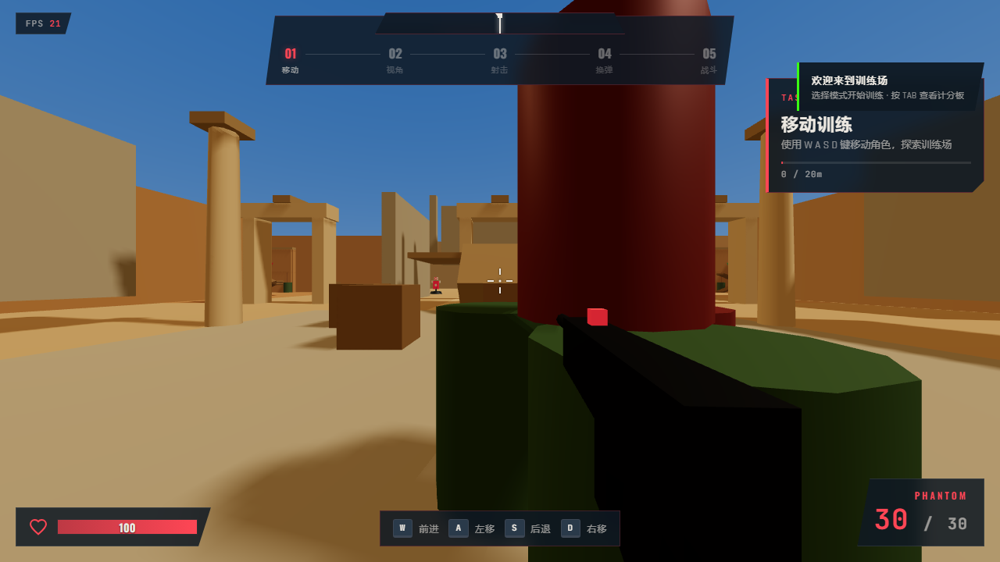
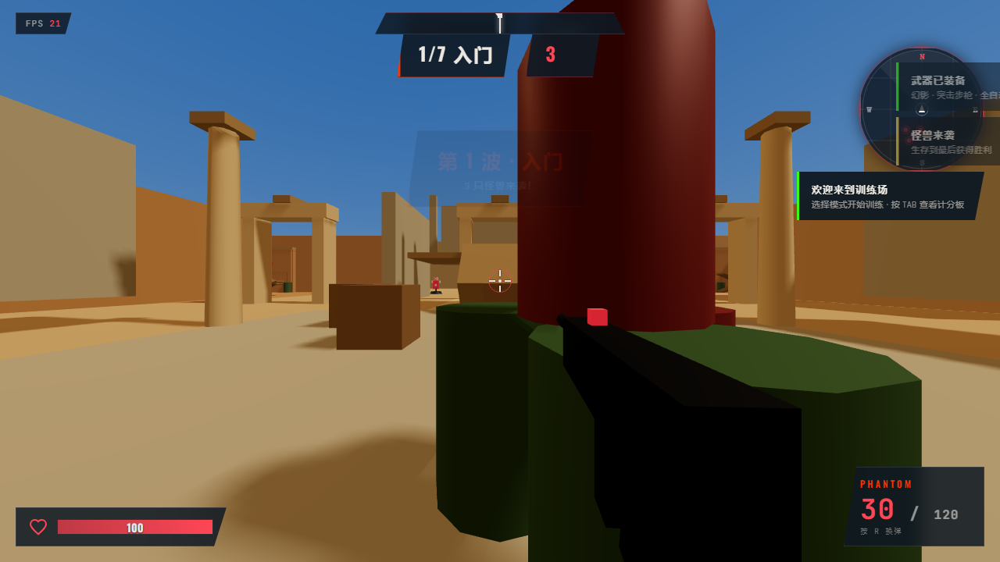
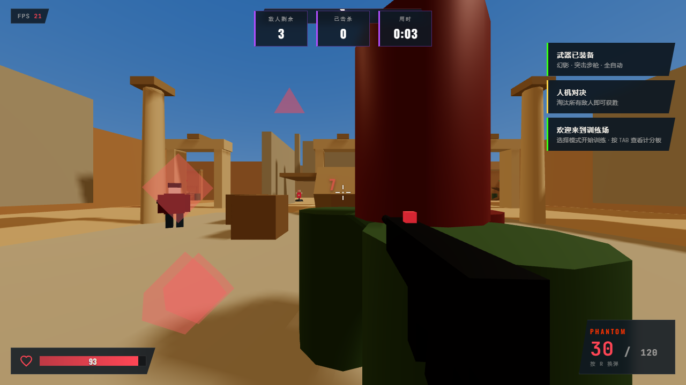
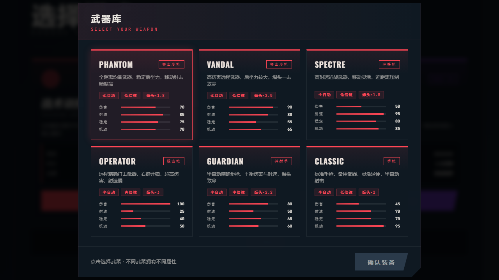
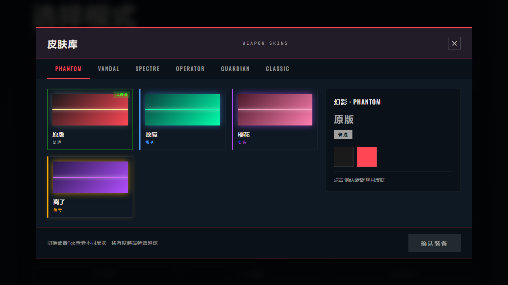

<div align="center">

# VALORANT TRAINING GROUND

### 基于 Three.js 的第一人称射击（FPS）战术训练游戏

[](https://xiaoyugegeh.github.io/-Shooting-Mini-Game/)
[](LICENSE)
[](https://threejs.org/)
[](https://developer.mozilla.org/en-US/docs/Web/JavaScript/Guide/Modules)
[](CONTRIBUTING.md)

**3 种游戏模式 · 6 把武器 · 18+ 款皮肤 · 智能 AI 对手 · 纯前端零依赖**

[🌐 English Version](#english) · [🚀 在线试玩](https://xiaoyugegeh.github.io/-Shooting-Mini-Game/) · [⭐ 点 Star](#star)

</div>

---

> 灵感来自《无畏契约》(VALORANT)，用纯前端技术打造的 3D 第一人称射击游戏。
> 无需安装任何依赖，打开浏览器即可游玩。


---

## 📑 目录

- [为什么这个项目值得你点 Star?](#-为什么这个项目值得你点-star)
- [游戏模式](#-游戏模式)
- [武器库](#-武器库)
- [皮肤系统](#-皮肤系统)
- [快速开始](#-快速开始)
- [操作指南](#-操作指南)
- [技术栈](#-技术栈)
- [项目结构](#-项目结构)
- [性能优化亮点](#-性能优化亮点)
- [自定义扩展](#-自定义扩展)
- [English Version](#english)
- [Star 引导](#star)

---

## ⭐ 为什么这个项目值得你点 Star?

- **零依赖纯前端** — 不用 npm install，不用 webpack，打开即玩
- **3 种完整游戏模式** — 训练 / PVE 怪兽 / PVP 人机对决
- **6 把差异化武器** — 每把武器有独立手感、弹道、后坐力
- **18+ 款武器皮肤** — 四阶稀有度系统，支持持久化保存
- **智能 AI 状态机** — 7 状态 AI，会侧移、躲避、爆头
- **战术小地图** — 实时敌人定位、方位罗盘
- **大量性能优化** — 对象池、GC 优化、共享几何体、AI 降频
- **一键在线试玩** — 通过 GitHub Pages 自动部署

---

## 🎮 游戏模式

### 训练模式

> 5 步递进式新手引导，从移动到射击全覆盖

学习 W A S D 移动、鼠标瞄准、左键射击、R 键换弹，最后进行综合战斗训练。靶标击毁后 3 秒自动重生，可反复练习。



### 怪兽讨伐

> 7 波递增怪兽，越往后越凶猛！

挥舞能量刀刃迎战怪兽潮，击杀回血（每波 +5HP），7 波全部通关即胜利。包含战术小地图显示怪兽位置。



### 人机对决

> 1 v 3 智能 AI，会移动、射击、躲避！

3 个难度递增的 AI 对手：
- **BOT-NOVICE**（新手）— 血量低、射速慢、精度差
- **BOT-AGENT**（特工）— 中等强度，会侧移规避
- **BOT-ELITE**（精英）— 高伤害、高精度、高血量

AI 拥有 7 状态状态机（巡逻 / 交战 / 推进 / 后撤 / 硬直 / 死亡），支持爆头判定、环境遮挡检测、散布机制。



---

## 🔫 武器库

游戏内置 6 把差异化武器，每把武器拥有独立的伤害、射速、后坐力与移动速度。在武器库中可以查看属性对比并选择出战装备。



---

## 🎨 皮肤系统

每把武器拥有多款皮肤，分为四个稀有度等级：

| 稀有度 | 颜色标识 | 特效 |
|:------:|:--------:|------|
| 普通 | 灰色 | 基础配色 |
| 稀有 | 蓝色 | 特殊配色 |
| 史诗 | 紫色 | 增强发光 |
| 传奇 | 金色 | 金属质感 + 强发光 |

皮肤配置通过 `localStorage` 持久化保存，下次打开自动加载。传奇皮肤拥有金属质感和增强发光效果！



---

## 🚀 快速开始

### 在线试玩

直接访问：**https://xiaoyugegeh.github.io/-Shooting-Mini-Game/**

### 本地运行

```bash
# 克隆仓库
git clone https://github.com/xiaoyugegeh/-Shooting-Mini-Game.git

# 进入目录
cd -Shooting-Mini-Game

# 启动本地服务器（任选一种）
python -m http.server 8080      # Python
npx serve                       # Node.js
```

浏览器打开 `http://localhost:8080` 即可开始游玩！

> 需要支持 ES Modules 的现代浏览器（Chrome / Edge / Firefox 最新版）

---

## 🕹️ 操作指南

| 操作 | 按键 | 说明 |
|:----:|:----:|------|
| 移动 | `W` `A` `S` `D` | 前后左右移动 |
| 视角 | 鼠标 | 转动视角 |
| 射击 | 鼠标左键 | 全自动武器按住连发 |
| 开镜 | 鼠标右键 | ADS 瞄准，降低散布 |
| 换弹 | `R` | 装填弹药 |
| 跳跃 | `空格` | 越过障碍 |
| 冲刺 | `Shift` | 加速移动 |
| 暂停 | `ESC` | 退出指针锁定 |
| 计分板 | `Tab` | 查看战斗统计 |

---

## 🛠️ 技术栈

| 技术 | 用途 |
|------|------|
| **Three.js r160** | WebGL 3D 渲染引擎 |
| **ES Modules** | 原生模块化（importmap 引入） |
| **Canvas 2D** | 小地图 / HUD 绘制 |
| **localStorage** | 皮肤配置持久化 |
| **Web Audio API** | 音效播放 |
| **CSS3** | UI 界面样式 |
| **GitHub Actions** | 自动部署到 GitHub Pages |

---

## 📁 项目结构

```
├── index.html                  # 入口页面
├── scripts/
│   ├── main.js                 # 启动入口
│   ├── core/
│   │   ├── Game.js             # 核心引擎
│   │   └── InputManager.js     # 输入管理
│   ├── player/
│   │   ├── Player.js           # 玩家角色
│   │   ├── CameraController.js # 第一人称相机
│   │   ├── Weapon.js           # 武器系统
│   │   └── MeleeWeapon.js      # 近战武器
│   ├── ai/
│   │   ├── Target.js           # 训练靶标
│   │   ├── Monster.js          # 怪兽 AI
│   │   └── Bot.js              # 人机 AI
│   ├── systems/
│   │   ├── CombatSystem.js     # 怪兽战斗管理
│   │   └── BotCombatSystem.js  # 人机战斗管理
│   ├── effects/
│   │   └── VisualEffects.js    # 视觉特效
│   ├── scene/
│   │   ├── SceneManager.js     # 场景管理
│   │   ├── Lighting.js         # 光照系统
│   │   └── Environment.js      # 环境构建
│   ├── audio/
│   │   └── AudioManager.js     # 音效管理
│   └── ui/
│       ├── HUD.js              # 训练 HUD
│       ├── MonsterHUD.js       # 怪兽 HUD
│       ├── BotHUD.js           # 人机 HUD
│       ├── MiniMap.js          # 战术小地图
│       ├── SkinSelect.js       # 皮肤选择面板
│       ├── WeaponSelect.js     # 武器选择面板
│       ├── SettingsPanel.js    # 设置面板
│       ├── Scoreboard.js       # 计分板
│       ├── Tutorial.js         # 新手教程
│       ├── Toast.js            # 通知提示
│       └── UIRouter.js         # UI 路由
├── styles/
│   └── main.css                # 全局样式
├── screenshots/                # 游戏截图
│   ├── screenshot-menu.png
│   ├── screenshot-weapon-select.png
│   ├── screenshot-skins.png
│   ├── screenshot-training-mode.png
│   ├── screenshot-monster-mode.png
│   └── screenshot-bot-mode.png
└── .github/
    └── workflows/
        └── deploy.yml          # GitHub Pages 自动部署
```

---

## ⚡ 性能优化亮点

这个项目包含大量前端性能优化实践：

| 优化项 | 说明 |
|--------|------|
| 对象池 | 弹道轨迹、Bot 弹道复用，避免频繁创建销毁 |
| 共享几何体 | 多个怪兽/Bot 共用 geometry 和 material |
| GC 优化 | 临时向量复用，射线检测复用 Sphere/Box3 |
| AI 降频 | 远距离 AI 每 2 帧更新状态机 |
| 几何体合并 | 静态环境物体合并为单个 Mesh |
| 动画循环守卫 | 防止重复启动导致多循环叠加卡死 |
| 帧率限制 | 最高 60 FPS，避免高刷显示器 GPU 过载 |

---

## 🔧 自定义扩展

### 添加新武器皮肤

编辑 `scripts/ui/WeaponSelect.js`：

```javascript
{
    id: 'my-skin',           // 皮肤唯一 ID
    nameCn: '我的皮肤',       // 显示名称
    rarity: 'epic',          // common / rare / epic / legendary
    bodyColor: 0x2a1a4a,     // 武器主体颜色
    accentColor: 0xb14eff,   // 装饰条颜色
    tracerColor: 0xcc66ff,   // 弹道颜色
    muzzleColor: 0xdd88ff    // 枪口闪光颜色
}
```

### 调整 AI 难度

编辑 `scripts/systems/BotCombatSystem.js` 的 `_spawnBots()` 方法：

```javascript
const configs = [
    { health: 60,  damage: 4,  speed: 2.6, fireRate: 0.7,  spread: 0.09, name: 'BOT-NOVICE' },
    { health: 80,  damage: 5,  speed: 3.0, fireRate: 0.55, spread: 0.07, name: 'BOT-AGENT'  },
    { health: 100, damage: 7,  speed: 3.4, fireRate: 0.45, spread: 0.05, name: 'BOT-ELITE'  }
];
```

---

<a name="english"></a>

# English Version

<div align="center">

### A First-Person Shooter (FPS) Tactical Training Game Built with Three.js

**3 Game Modes · 6 Weapons · 18+ Skins · Smart AI Opponents · Zero Dependencies**

[🎮 Play Online](https://xiaoyugegeh.github.io/-Shooting-Mini-Game/) · [⭐ Give a Star](#star)

</div>

## ⭐ Why Star This Project?

- **Zero Dependencies** — No npm install, no webpack, just open and play
- **3 Complete Game Modes** — Training / PVE Monster Hunt / PVP Bot Deathmatch
- **6 Distinct Weapons** — Each with unique feel, ballistics, and recoil
- **18+ Weapon Skins** — 4 rarity tiers with persistent localStorage saving
- **Smart AI State Machine** — 7-state AI with strafing, dodging, and headshots
- **Tactical Minimap** — Real-time enemy tracking and compass
- **Performance Optimized** — Object pooling, shared geometries, GC optimization
- **One-Click Online Play** — Auto-deployed via GitHub Pages

## 🎮 Game Modes

### Training Ground
A 5-step progressive tutorial covering movement, aiming, shooting, and reloading.

### Monster Hunt
7 waves of increasingly fierce monsters! Slash with an energy blade, gain HP on kills, and survive to win.

### Bot Deathmatch
1v3 intelligent AI opponents. Three difficulty levels with realistic movement, shooting, and dodging.

## 🚀 Quick Start

**Play Online:** https://xiaoyugegeh.github.io/-Shooting-Mini-Game/

**Local Run:**

```bash
git clone https://github.com/xiaoyugegeh/-Shooting-Mini-Game.git
cd -Shooting-Mini-Game
python -m http.server 8080
```

Then open `http://localhost:8080` in your browser.

## 🕹️ Controls

| Action | Key | Description |
|--------|-----|-------------|
| Move | `W` `A` `S` `D` | Move around |
| Look | Mouse | Aim |
| Shoot | Left Click | Fire weapon |
| Aim | Right Click | ADS, reduces spread |
| Reload | `R` | Reload ammo |
| Jump | `Space` | Jump over obstacles |
| Sprint | `Shift` | Move faster |
| Pause | `ESC` | Release pointer lock |
| Scoreboard | `Tab` | View combat stats |

## 🛠️ Tech Stack

Three.js r160 · ES Modules · Canvas 2D · localStorage · Web Audio API · CSS3 · GitHub Actions

## ⚡ Performance Highlights

Object pooling, shared geometries, vector reuse, AI throttling, merged static meshes, animation loop guard, and 60 FPS cap.

---

<div align="center">

<a name="star"></a>

## 觉得不错？点个 Star 支持一下！

## Enjoy the game? Give it a Star! ⭐

如果这个项目对你有帮助，欢迎 Star 支持！

If you find this project helpful, please give it a star!

也欢迎提 Issue 反馈问题或提交 PR 贡献代码。

Issues and Pull Requests are welcome.

---

**License:** MIT · **Inspired by:** VALORANT (Riot Games) · **Powered by:** Three.js

</div>
